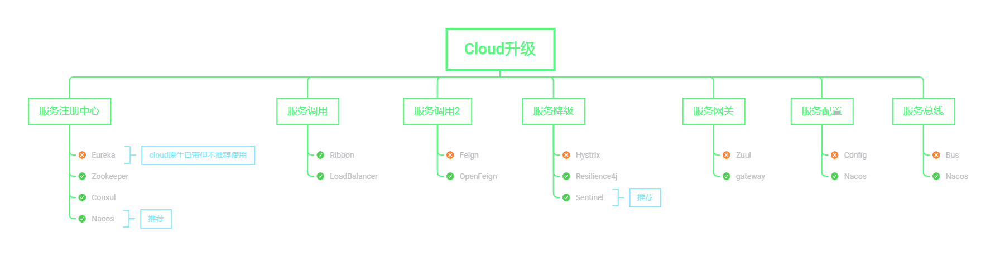

> 微服务学习路线

1. 官方源码下载：https://github.com/zzyybs/atguigu_spirngcloud2020

2. MD格式笔记+软件安装包：链接：https://pan.baidu.com/s/11AiwMzPgWXjI5XJ1trfAxQ 提取码：dkf6

3. 在线环境搭建：
   1. https://blog.csdn.net/qq_42107430/article/details/104683947
   2. 初级：https://blog.csdn.net/qq_41211642/article/details/104772140

4. 脑图文件：https://github.com/EiletXie/cloud2020/blob/master/SpringCloud2020.mmap

5. B站地址：
   1. 建立Moudule
   2. 该Pom文件
   3. 修改yml文件

6. 微服务学习路线

   

   