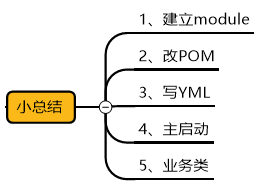
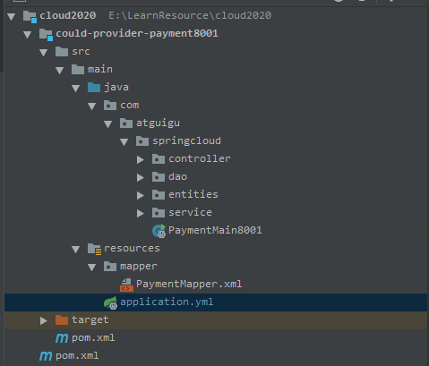
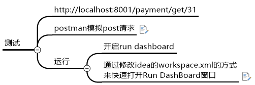

1. 要遵循一个原则，约定>配置>编码

2. 创建项目步骤

   

   1. 建立Module

      

   2. 改Pom文件

      1. 父类pom

         ```xml
         <?xml version="1.0" encoding="UTF-8"?>
         
         <project xmlns="http://maven.apache.org/POM/4.0.0" xmlns:xsi="http://www.w3.org/2001/XMLSchema-instance"
           xsi:schemaLocation="http://maven.apache.org/POM/4.0.0 http://maven.apache.org/xsd/maven-4.0.0.xsd">
           <modelVersion>4.0.0</modelVersion>
         
           <groupId>com.atguigu</groupId>
           <artifactId>cloud2020</artifactId>
           <version>1.0-SNAPSHOT</version>
           <packaging>pom</packaging>
         
           <modules>
             <module>could-provider-payment8001</module>
           </modules>
         
           <!--统一管理jar包和版本-->
           <properties>
             <project.build.sourceEncoding>UTF-8</project.build.sourceEncoding>
             <maven.compiler.source>1.8</maven.compiler.source>
             <maven.compiler.target>1.8</maven.compiler.target>
             <junit.version>4.12</junit.version>
             <log4j.version>1.2.17</log4j.version>
             <lombok.version>1.16.18</lombok.version>
             <mysql.version>8.0.18</mysql.version>
             <druid.verison>1.1.16</druid.verison>
             <mybatis.spring.boot.verison>1.3.0</mybatis.spring.boot.verison>
           </properties>
         
           <!--子模块继承之后，提供作用：锁定版本+子模块不用写groupid和version-->
           <!--dependencyManagement和dependencies区别-->
           <dependencyManagement>
             <dependencies>
               <!--spring boot 2.2.2-->
               <dependency>
                 <groupId>org.springframework.boot</groupId>
                 <artifactId>spring-boot-dependencies</artifactId>
                 <version>2.2.2.RELEASE</version>
                 <type>pom</type>
                 <scope>import</scope>
               </dependency>
               <!--spring cloud Hoxton.SR1-->
               <dependency>
                 <groupId>org.springframework.cloud</groupId>
                 <artifactId>spring-cloud-dependencies</artifactId>
                 <version>Hoxton.SR1</version>
                 <type>pom</type>
                 <scope>import</scope>
               </dependency>
               <!--spring cloud alibaba 2.1.0.RELEASE-->
               <dependency>
                 <groupId>com.alibaba.cloud</groupId>
                 <artifactId>spring-cloud-alibaba-dependencies</artifactId>
                 <version>2.1.0.RELEASE</version>
                 <type>pom</type>
                 <scope>import</scope>
               </dependency>
               <!-- MySql -->
               <dependency>
                 <groupId>mysql</groupId>
                 <artifactId>mysql-connector-java</artifactId>
                 <version>${mysql.version}</version>
               </dependency>
               <!-- Druid -->
               <dependency>
                 <groupId>com.alibaba</groupId>
                 <artifactId>druid-spring-boot-starter</artifactId>
                 <version>${druid.verison}</version>
               </dependency>
               <!-- mybatis-springboot整合 -->
               <dependency>
                 <groupId>org.mybatis.spring.boot</groupId>
                 <artifactId>mybatis-spring-boot-starter</artifactId>
                 <version>${mybatis.spring.boot.verison}</version>
               </dependency>
               <!--lombok-->
               <dependency>
                 <groupId>org.projectlombok</groupId>
                 <artifactId>lombok</artifactId>
                 <version>${lombok.version}</version>
               </dependency>
               <!--junit-->
               <dependency>
                 <groupId>junit</groupId>
                 <artifactId>junit</artifactId>
                 <version>${junit.version}</version>
               </dependency>
               <!-- log4j -->
               <dependency>
                 <groupId>log4j</groupId>
                 <artifactId>log4j</artifactId>
                 <version>${log4j.version}</version>
               </dependency>
             </dependencies>
           </dependencyManagement>
         
           <build>
             <plugins>
               <plugin>
                 <groupId>org.springframework.boot</groupId>
                 <artifactId>spring-boot-maven-plugin</artifactId>
                 <configuration>
                   <fork>true</fork>
                   <addResources>true</addResources>
                 </configuration>
               </plugin>
             </plugins>
           </build>
         
         </project>
         ```

      2. 子模块pom

         ```xml
         <?xml version="1.0" encoding="UTF-8"?>
         <project xmlns="http://maven.apache.org/POM/4.0.0"
                  xmlns:xsi="http://www.w3.org/2001/XMLSchema-instance"
                  xsi:schemaLocation="http://maven.apache.org/POM/4.0.0 http://maven.apache.org/xsd/maven-4.0.0.xsd">
             <parent>
                 <artifactId>cloud2020</artifactId>
                 <groupId>com.atguigu</groupId>
                 <version>1.0-SNAPSHOT</version>
             </parent>
             <modelVersion>4.0.0</modelVersion>
         
             <artifactId>could-provider-payment8001</artifactId>
         
         
             <dependencies>
                 <!--前两个绑定在一起-->
                 <dependency>
                     <groupId>org.springframework.boot</groupId>
                     <artifactId>spring-boot-starter-web</artifactId>
                 </dependency>
                 <dependency>
                     <groupId>org.springframework.boot</groupId>
                     <artifactId>spring-boot-starter-actuator</artifactId>
                 </dependency>
                 <dependency>
                     <groupId>org.mybatis.spring.boot</groupId>
                     <artifactId>mybatis-spring-boot-starter</artifactId>
                 </dependency>
                 <dependency>
                     <groupId>com.alibaba</groupId>
                     <artifactId>druid-spring-boot-starter</artifactId>
                 </dependency>
                 <!--mysql-connector-java-->
                 <dependency>
                     <groupId>mysql</groupId>
                     <artifactId>mysql-connector-java</artifactId>
                 </dependency>
                 <dependency>
                     <groupId>org.springframework.boot</groupId>
                     <artifactId>spring-boot-starter-jdbc</artifactId>
                 </dependency>
                 <dependency>
                     <groupId>org.springframework.boot</groupId>
                     <artifactId>spring-boot-devtools</artifactId>
                     <scope>runtime</scope>
                     <optional>true</optional>
                 </dependency>
                 <dependency>
                     <groupId>org.projectlombok</groupId>
                     <artifactId>lombok</artifactId>
                     <optional>true</optional>
                 </dependency>
                 <dependency>
                     <groupId>org.springframework.boot</groupId>
                     <artifactId>spring-boot-starter-test</artifactId>
                     <scope>test</scope>
                 </dependency>
             </dependencies>
         
         </project>
         ```

   3. 写YML文件

      ```yml
      server:
        port: 8001
      
      spring:
        application:
          name: cloud-payment-service
        datasource:
          type: com.alibaba.druid.pool.DruidDataSource      #当前数据源操作类型
          driver-class-name: com.mysql.cj.jdbc.Driver       #mysql驱动包
          url: jdbc:mysql://localhost:3306/cloud?characterEncoding=utf8&useSSL=false&serverTimezone=UTC&rewriteBatchedStatements=true
          username: root
          password: root
      
      mybatis:
        mapper-locations: classpath:mapper/*.xml
        type-aliases-package: com.atguigu.springcloud.entities       #所有Entity别名类所在包
      ```

   4. 主启动类

      ```java
      @SpringBootApplication
      public class PaymentMain8001 {
          public static void main(String[] args) {
              SpringApplication.run(PaymentMain8001.class, args);
          }
      }
      ```

   5. 业务类

      

   6. 测试

      

   