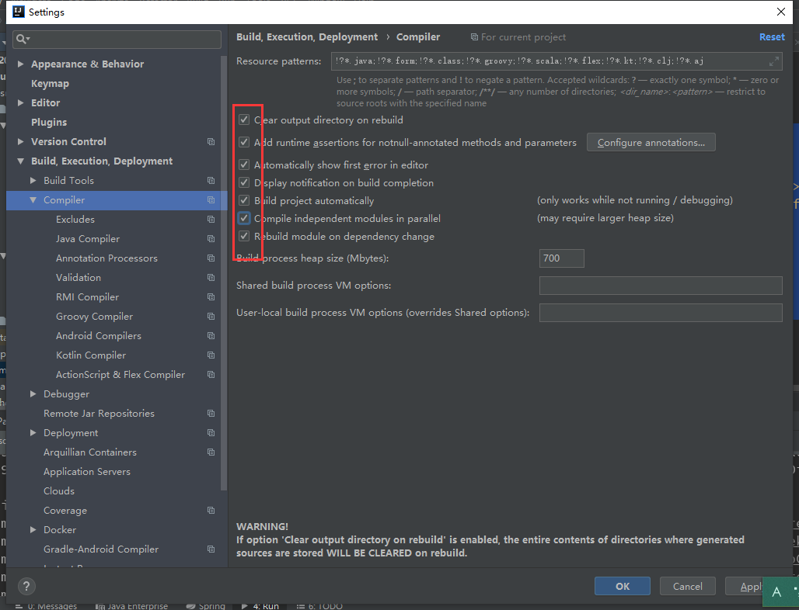
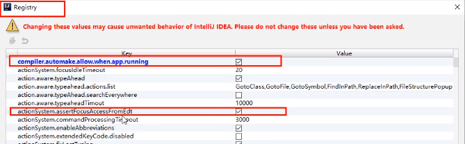

> 在开发阶段要开启热部署

1. 在子模块Pom插入

   ```xml
   <!--热部署工具-->
   <dependency>
       <groupId>org.springframework.boot</groupId>
       <artifactId>spring-boot-devtools</artifactId>
       <scope>runtime</scope>
       <optional>true</optional>
   </dependency>
   ```

2. 在父Pom插入

   ```xml
   <!--热启动插件-->
   <build>
     <plugins>
       <plugin>
         <groupId>org.springframework.boot</groupId>
         <artifactId>spring-boot-maven-plugin</artifactId>
         <configuration>
           <fork>true</fork>
           <addResources>true</addResources>
         </configuration>
       </plugin>
     </plugins>
   </build>
   ```

3. idea设置

   

4. 更新idea配置

   1. CTRL+SHIFT + ALT + /，打开上面的这个界面，选择 registry

   2. 主要是打开 compiler.aotomake.allow.when.app.running

      

5. 结束

