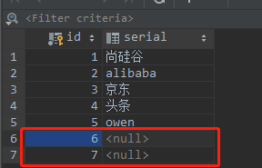

>@RequestBody

在进行post请求的时候，不要忘记在实体类加上这个注解，否则数据库数据将插入为空

加上@RequestBody注解后，可以将数据插入成功，注解主要作用于用户发送post请求，前端将json数据放在请求体。如果请求请来的是参数用@RequestParam，前者一个方法只能由一个，后者可以多个

> @ResponseBody

常见于用户get请求，用这个注解返回json数据给前端。