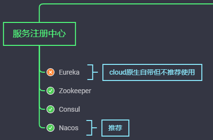

>CAP理论

* **分布式的CAP理论**
  * C：Consistency-一致性，所有节点访问同一份最新的数据副本
  * A：Available-可用性，非故障的节点在合理的时间返回合理的响应
  * P：Partition-Tolerence-分区容错性，分布式系统出现网络分区时，仍然可以对外提供服务
* **在系统发送分区的情况下（前提）**，P是一定要满足的，只能在A和C中二选一，Eureka满足AP，Zookeeper满足CP，Nacos不仅支持CP也支持AP
  * CP：适用于强一致性，向银行类业务
  * AP：不是很严谨，保证程序正常运行即可，小误差可以接收。
* 