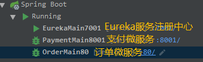
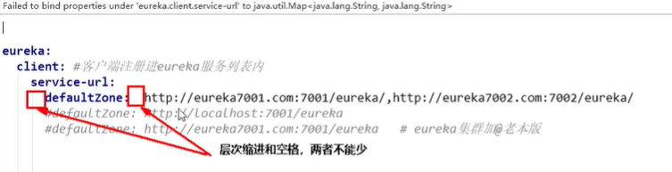
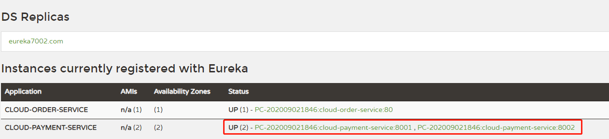
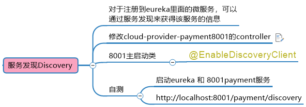
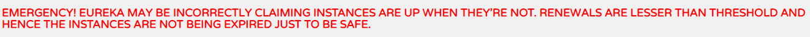
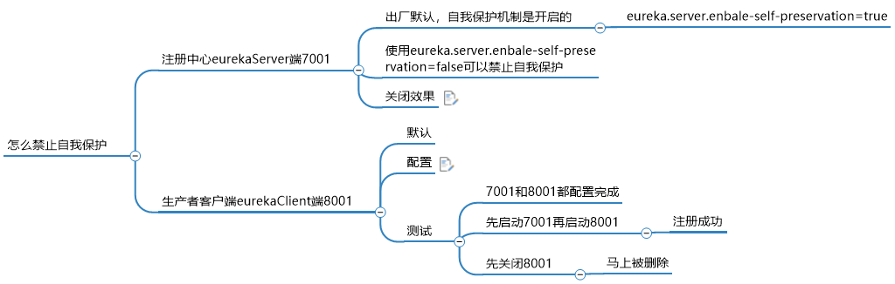
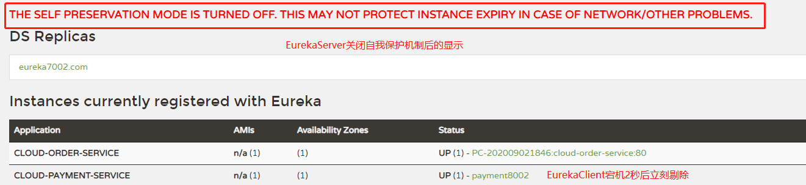

> 服务治理

管理服务与服务之间的依赖关系，可以实现服务调用，容错，负载均衡。



* 注意：yml配置文件不能出现空格或者缩进

  

* 如果构造集群，在本机搭建环境，需要在<u>C:\Windows\System32\drivers\etc\下的host文件</u>下修改，如果windows如果找不到可以通过此[方法：windows10系统hosts文件不见了的解决方法](http://www.xitongcheng.com/jiaocheng/win10_article_28177.html)解决。

* **避坑**：本地模拟集群环境的时候，这个是向注册中心注册的地址，但不代表拿到浏览器可以打开eureka，需要“/eureka”，一直认为是host文件未修改成功所导致的问题，查了很久。

  ```yaml
  defaultZone: http://eureka7002.com:7002/eureka
  ```

> @LoadBalance

集群环境下，在使用RestTemplate的时候，需要加上这个注解，实现Eureka的负载均衡，否则客户端调用服务端不知道用那个服务提供者。**默认使用的是轮询方式**

```java
@Bean
@LoadBalanced //RestTemplate提供的负载均衡策略,否则会报错
public RestTemplate getRestTemplate() {
    return new RestTemplate();
}

public class OrderController {
    //客户端URL，为Eureka中注册的服务
    private static final String PAYMENT_URL = "http://CLOUD-PAYMENT-SERVICE";
    
    ...
}
```

> 需要注意



* 可以从图上看出，status的状态码很长，可以自定义更改。而且以后在生产环境中，可以快速找到对应ip和端口号

* pom中引入这两个依赖

  ```xml
  <!--前两个绑定在一起-->
  <dependency>
      <groupId>org.springframework.boot</groupId>
      <artifactId>spring-boot-starter-web</artifactId>
  </dependency>
  <dependency>
      <groupId>org.springframework.boot</groupId>
      <artifactId>spring-boot-starter-actuator</artifactId>
  </dependency>
  ```

* 在application中添加以下内容

  ```yaml
  eureka:
    client:
  	...
    # 添加这两个文件
    instance:
      instance-id: payment8001 #修改eureka主页状态名称Status
      prefer-ip-address: true  #鼠标悬在status地址上，能够看到对应ip和端口，方便调试
  ```

> @EnableDiscoveryClient



* 这个注解可通过服务发现获取服务的信息，在以后很重要

> Eureka自我保护机制

* 故障现象：当我们看到Eureka报以下错误，意味着开启了自我保护机制



* 产生原因：网络故障（延迟、卡顿、拥挤）

* 什么是自我保护机制？

  为了防止EurekaClient的正常运行，但是与EurekaServer网络不通的时候，不会立刻剔除有问题的EurekaServer

* 运行原理

  默认情况下，EurekaServer没有接收到某个微服务的心跳，EurekaServer会注销该实例（默认是90秒），但是开启自我保护机制后，可能因为网络故障导致，微服务不能与Eurekaserver进行通信，但是该微服务本身是正常的，所以不会立即删除，而是保留该服务。等待EurekaServer收到服务发送的心跳，则继续提供对外提供服务。

  符合Eureka的AP原理，保证服务的可用性--好死不如赖活着

* 总结：

  Eureka就是一种应对网络故障分区而产生的一种解决方式，宁可保留所有微服务，也不盲目删除任何微服务。

* 关闭自我保护机制

  

  