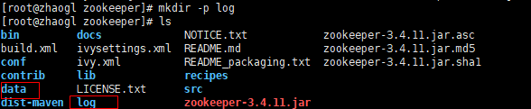

> 搭建Zookeeper在contOS7上

1. 首先下载Zookeeper的gz压缩包，传送至服务器

2. 解压到指定目录，或者去掉-C /usr/local/zookeeper/，解压到当前目录

   ```bash
   tar -zxvf zookeeper-3.4.6.tar.gz -C /usr/local/zookeeper/
   ```

3. 在zookeeper文件夹下创建数据和日志存放目录

   

4. 先把conf下的zoo_sample.cfg备份，重命名为zoo.cfg

   ```bash
   cp zoo_sample.cfg zoo.cfg
   ```

5. 修改配置文件

   ```bash
   vim zoo.zfg
   
   #存储快照文件snapshot的目录。默认情况下，事务日志也会存储在这里。建议同时配置参数dataLogDir, 事务日志的写性能直接影响zk性能
   dataDir=/usr/local/zookeeper/zookeeper-3.4.6/data
   #事务日志输出目录。尽量给事务日志的输出配置单独的磁盘或是挂载点，这将极大的提升ZK性能
   dataLogDir=/usr/local/zookeeper/zookeeper-3.4.6/logs
   ```

6. 配置环境变量

   

7. 生效配置文件

   source .bash_profile

8. 进入zookeeper/bin目录

9. zkServer.sh start

   ```bash
   [root@zhaogl bin]# ./zkServer.sh start
   ZooKeeper JMX enabled by default
   Using config: /home/owenzhao/zookeeper/bin/../conf/zoo.cfg
   Starting zookeeper ... STARTED
   ```

10. 看到上面代表关闭

11. 开启对应端口的防火墙

    ```bash
    # 将文件上传，项目发布还是将对应防火墙的端口进行打开 # 开启防火墙，增加9000这个端口 
    firewall-cmd --zone=public --add-port=8899/tcp --permanent 
    # 重启防火墙，添加端口后需要重启 
    systemctl restart firewalld.service 
    # 查看所有开启的端口，如果是阿里云，需要配置安全组规则 
    firewall-cmd --list-ports
    ```

12. 阿里云配置规则打开该端口

13. 查看本机IP，ifconfig，172.27.139.24

    ```bash
    [root@zhaogl zookeeper]# ifconfig
    eth0: flags=4163<UP,BROADCAST,RUNNING,MULTICAST>  mtu 1500
            inet 172.27.139.24  netmask 255.255.240.0  broadcast 172.27.143.255
            inet6 fe80::216:3eff:fe2e:3ffe  prefixlen 64  scopeid 0x20<link>
            ether 00:16:3e:2e:3f:fe  txqueuelen 1000  (Ethernet)
            RX packets 981475  bytes 648711918 (618.6 MiB)
            RX errors 0  dropped 0  overruns 0  frame 0
            TX packets 610598  bytes 183950435 (175.4 MiB)
            TX errors 0  dropped 0 overruns 0  carrier 0  collisions 0
    ```

14. 保证服务器可以ping通本地主机

    ```bash
    PING 127.25.44.63 (127.25.44.63) 56(84) bytes of data.
    64 bytes from 127.25.44.63: icmp_seq=1 ttl=64 time=0.074 ms
    64 bytes from 127.25.44.63: icmp_seq=2 ttl=64 time=0.074 ms
    64 bytes from 127.25.44.63: icmp_seq=3 ttl=64 time=0.064 ms
    ```

15. zookeeper是临时节点

> 注意

* zookeeper用完之后需要关闭客户端和服务端，否则会导致服务在服务列表中依旧存在。