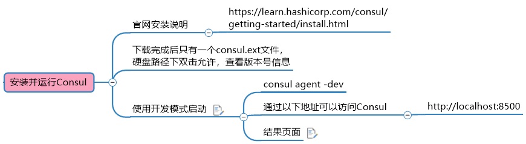

>Consul是什么

是一个分布式服务发现和配置管理系统，是Go语言写的。

> 提供功能

* 服务发现
* 健康监测
* KV键值对存储
* 多数据中心
* 可视化界面

>下载地址

www.consul.io/downloads.html

> 中文官方文档学习

http://www.springcloud.cc/spring-cloud-consul.html

> 安装运行

