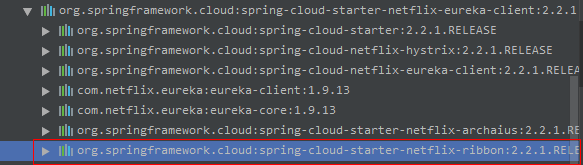
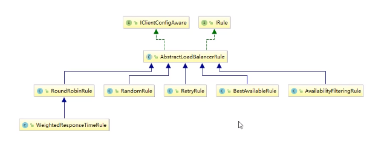
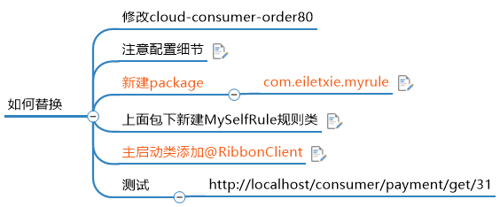
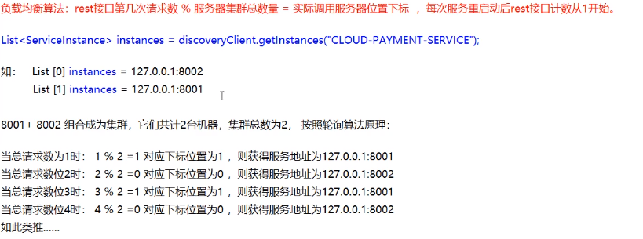
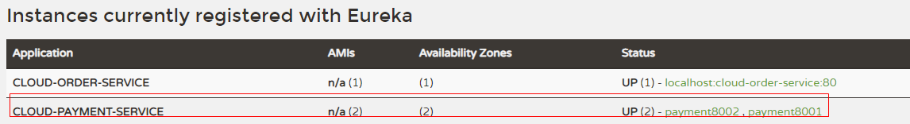

> Ribbon

他是一种客户端的负载均衡器，提供完成的配置项，就是配置文件中列出Load Balancer后面所有的机器，ribbon会给予某种规则连接机器。使用负载均衡算法

Ribbon是客户端的负载均衡，属于进程内的负载均衡。Nginx是服务端的负载均衡，属于集中式的负载均衡。

* 进程内负载均衡

  将loadBalancer逻辑继承到消费方，消费者从服务注册中心获知那些地址可用，然后从这些地址选出一个合适的服务器。如Ribbon，继承于消费方进行，消费方通过它获取服务提供方的地址。

* 集中式的负载均衡

  在**服务的消费方和提供方之间使用的独立LB设施**，如nginx，由该设施**将对象的提供方通过某种规则转发至服务的提供方**。

一句话概括，Ribbon就是负载均衡器和RestTemplate调用

在netflix的H版本，Eureka-client中已经集成了ribbon依赖，所以不用引入maven依赖



> RestTemplate

* getForObject()/getForEntity

RestTemplate里面有getForObject()/getForEntity，都是用来获取实体，前者获取json串，后者也可以获取，但是获取的类型更具体，大多数使用的是getForObject，就够用

```java
@GetMapping("/consumer/payment/getEntity/{id}")
public CommonResult<Payment> getPaymentById1(@PathVariable("id") Long id) {
    ResponseEntity<CommonResult> entity = restTemplate.getForEntity(PAYMENT_URL + "/payment/get/" + id, CommonResult.class);
    if (entity.getStatusCode().is2xxSuccessful()) {
        return entity.getBody();
    } else {
        return new CommonResult<>(445, "操作失败");
    }
}
```

* postForObject()和postForEntity()

> Ribbon算法

除了轮询算法，Ribbon本身还提供其他六种负载均衡算法，其中Ribbon里面有一个IRule接口，通过选择特定算法来从服务列表中选择一个服务进行调用。



1. RoundRobinRule:轮询算法，默认规则
2. RandomRule：随机
3. RetryRule：在轮询基础之上运行，如果获取服务失败，在是一定时间进行重试
4. WeightResponseTimeRule：对轮询的拓展，响应速度越快的实例选择权重越大
5. BestAvailableRule：过滤掉由于多次访问故障而处于断路器跳闸状态的服务，选择一个并发量最小的服务
6. AvailabilityFilterRule：先过滤掉故障的服务，在选择并发量小的实例
7. ZoneAvoidanceRule：复合判断**server所在区域的性能**和**server的可用性**选择服务

> 如何替换Ribbon规则



* 需要注意细节:自定义的Ribbon负载均衡算法不能再@ComponentScan包及子包下

  ```java
  /**
   * @program: cloud2020
   * @description: 自定义的Ribbon负载均衡算法不能再@ComponentScan包及子包下
   *               意味着说不能再@SpringBootApplication包下
   * @author: Owen Zhao
   * @create: 2021-02-04 15:05
   */
  @Configuration
  public class MySelfRule {
  
      @Bean
      public IRule myRule() {
          //定义为随机策略
          return new RandomRule();
      }
  }
  ```

* 启动类添加：@RibbonClient(value = "CLOUD-PAYMENT-SERVICE", configuration = MySelfRule.class)

  ```java
  @SpringBootApplication
  @EnableEurekaClient
  @RibbonClient(value = "CLOUD-PAYMENT-SERVICE", configuration = MySelfRule.class)
  public class OrderMain80 {
  
      public static void main(String[] args) {
          SpringApplication.run(OrderMain80.class, args);
      }
  }
  ```

> Ribbon负载均衡算法原理

**负载均衡算法：请求的第几次数(Q) % 服务器的数量(F) = 实际调用服务器下标。**如果服务器重启，请求的次数Q将重1开始。





从Eureka中可以看到，CLOUD-PAYMENT-SERVICE是有两个服务器，所以服务器的数量为2

> 源码解读

Ribbon中IRule接口的choose方法，主要是用来选择算法策略

```java
public Server choose(ILoadBalancer lb, Object key) {
    //如果无负载均衡器直接报错
    if (lb == null) {
        log.warn("no load balancer");
        return null;
    }

    Server server = null;
    int count = 0;
    while (server == null && count++ < 10) {
        //获取所有可达的服务实例
        List<Server> reachableServers = lb.getReachableServers();
        //获取所有服务，包括可达和不可达的
        List<Server> allServers = lb.getAllServers();
        int upCount = reachableServers.size();
        int serverCount = allServers.size();

        //如果可达数为0，说明服务有问题，直接报错
        if ((upCount == 0) || (serverCount == 0)) {
            log.warn("No up servers available from load balancer: " + lb);
            return null;
        }

        //选择下一次的选择服务的索引下标，方法里面用到AtomicInteger和CAS
        int nextServerIndex = incrementAndGetModulo(serverCount);
        //确定下表后，选择对应服务
        server = allServers.get(nextServerIndex);
        ................
    }
	...........
    return server;
}

private AtomicInteger nextServerCyclicCounter;

//构造方法已经初始化该值
public RoundRobinRule() {
        nextServerCyclicCounter = new AtomicInteger(0);
}

//nextServerCyclicCounter为AtomicInteger实现类，通过CAS来进行获取下标值
private int incrementAndGetModulo(int modulo) {
        for (;;) {
            int current = nextServerCyclicCounter.get();
            int next = (current + 1) % modulo;
            if (nextServerCyclicCounter.compareAndSet(current, next))
                return next;
        }
}
```

> 自定义负载均衡器

1. 注释客户端@LoadBalancer

   ```java
   @Configuration
   public class ApplicationContextConfig {
   
       @Bean
   //    @LoadBalanced //RestTemplate提供的负载均衡策略,否则会报错，注释是因为手动测试调用自己写的负载均衡器
       public RestTemplate getRestTemplate() {
           return new RestTemplate();
       }
   }
   ```

2. 创建负载均衡接口

   ```java
   public interface LoadBalancer {
   
       ServiceInstance instances(List<ServiceInstance> serviceInstances);
   }
   ```

3. 实现该接口

   ```java
   @Component
   @Slf4j
   public class MyLB implements LoadBalancer {
   
       //定义初始类
       private static AtomicInteger atomicInteger = new AtomicInteger(0);
   
       //模拟CAS方法
       private int getAndIncrement() {
           int current;
           int next;
           do {
               current = atomicInteger.get();
               next = current >= 2147483647 ? 0 : current + 1;
           } while (!this.atomicInteger.compareAndSet(current, next));
           log.info("*****next ：" + next);
           return next;
       }
   
       //请求的第几次数(Q) % 服务器的数量(F) = 实际调用服务器下标
       @Override
       public ServiceInstance instances(List<ServiceInstance> serviceInstances) {
           int nextIndex = getAndIncrement() % serviceInstances.size();
           return serviceInstances.get(nextIndex);
       }
   
   }
   ```

4. 在服务端集群各服务器测试用例

   ```java
   /**
    * 测试自定义负载均衡器
    *
    * @return
    */
   @GetMapping(value = "/payment/lb")
   public String getPaymentLB() {
       return serverPort;
   }
   ```

5. 在客户端调用负载均衡器

   ```java
   @Resource
   private LoadBalancer loadBalancer;
   
   @Resource
   private DiscoveryClient discoveryClient;
   
   /**
        * 通过自定义负载均衡器，获取服务
        * @return
        */
       @GetMapping("/consumer/payment/mylb")
       public String getPayment() {
           List<ServiceInstance> instances = discoveryClient.getInstances("CLOUD-PAYMENT-SERVICE");
   
           if (instances == null || instances.size() < 0) {
               return null;
           }
           
           ServiceInstance instance = loadBalancer.instances(instances);
           URI uri = instance.getUri();
           return restTemplate.getForObject(uri + "/payment/lb", String.class);
       }
   ```

6. 重启客户端，调用查看结果

   ```bash
   2021-02-04 16:43:30.491  INFO 3612 --- [p-nio-80-exec-1] com.atguigu.springcloud.lb.MyLB          : *****next ：2
   2021-02-04 16:43:31.342  INFO 3612 --- [p-nio-80-exec-3] com.atguigu.springcloud.lb.MyLB          : *****next ：3
   2021-02-04 16:43:31.602  INFO 3612 --- [p-nio-80-exec-4] com.atguigu.springcloud.lb.MyLB          : *****next ：4
   2021-02-04 16:43:31.819  INFO 3612 --- [p-nio-80-exec-5] com.atguigu.springcloud.lb.MyLB          : *****next ：5
   2021-02-04 16:43:32.174  INFO 3612 --- [p-nio-80-exec-6] com.atguigu.springcloud.lb.MyLB          : *****next ：6
   2021-02-04 16:43:32.487  INFO 3612 --- [p-nio-80-exec-7] com.atguigu.springcloud.lb.MyLB          : *****next ：7
   2021-02-04 16:43:38.570  INFO 3612 --- [p-nio-80-exec-8] com.atguigu.springcloud.lb.MyLB          : *****next ：8
   2021-02-04 16:43:38.743  INFO 3612 --- [p-nio-80-exec-9] com.atguigu.springcloud.lb.MyLB          : *****next ：9
   2021-02-04 16:43:39.086  INFO 3612 --- [-nio-80-exec-10] com.atguigu.springcloud.lb.MyLB          : *****next ：10
   ```

7. Over

