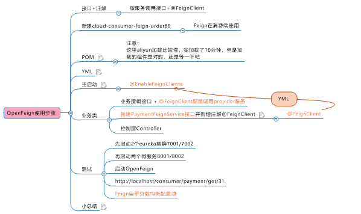
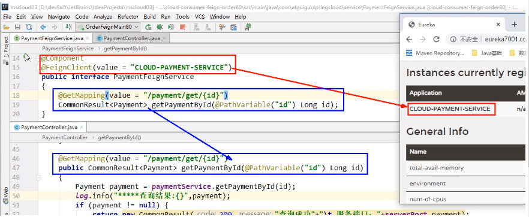

> Open Feign

**定义**

OpenFeign是一个声明式的Web服务客户端，可以让编码变得更加容易，只需要创建一个接口，在接口中声明注解@FeignClient，前提是主启动类需要添加EnableFeignClient

相对于Ribbon+RestTemplate的方式更加方便，Feign内置了Ribbon，也可以进行负载均衡，去调用注册中心的服务。

**作用**

就是让编写HTTP客户端变得更加简单

之前Ribbon+RestTemplate需要通过restTemplate的getForObject/postForObject等进行服务调用，但是这种调用很多。通过Feign封装，通过注解的方式，可以简化客户端的编写，并且实现对服务调用以及负载均衡。

Feign内置Ribbon，通过轮询的方式实现负载均衡

**操作步骤**





**日志打印功能**

feign提供日志打印功能，就是对Feign接口调用情况进行监控和输出

四种日志级别：

​	None：默认的，不显示任何日志

​	Basic：仅记录请求方法、URL、响应状态码及时间

​	Headers：除了几率Basic里的，还有请求头和响应头信息

​	FULL：除了Headers的信息外，还有请求和响应的正文及元数据

* 步骤：

  1. 配置日志Bean  

     ```java
     @Configuration
     public class FeignConfig {
         @Bean
         Logger.Level feignLoggerLevel() {
             return  Logger.Level.FULL;
         }
     }
     ```

  2. YAML文件中开启日志的Feign客户端

     ```yaml
     logging:
       level: 
         #feign日志以什么级别监控那个接口
         com.eiletxie.springcloud.service.PaymentFeginService: debug
     ```