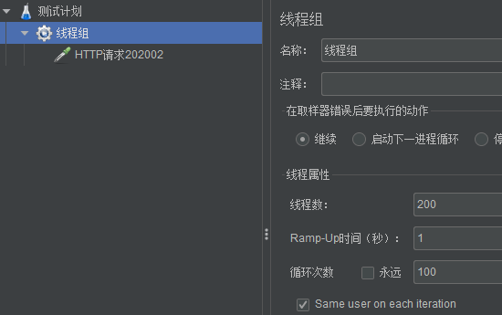
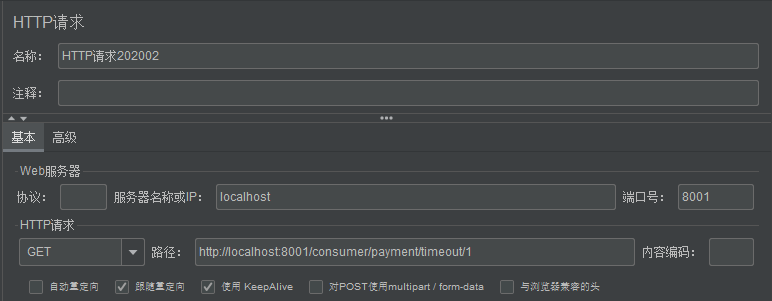

> 通过Jmeter测试



通过以上两种测试，可以看到本来秒回的服务都会加载延迟。上面还是在服务端测试，为了避免延迟卡死，需要采用降级的措施

Hystrix服务降级一般是在客户端进行使用。

```java
@HystrixCommand(fallbackMethod = "paymentInfo_TimeoutHandler",commandProperties = {
        @HystrixProperty(name = "execution.isolation.thread.timeoutInMilliseconds",value = "10000")
})
```

等待1秒，如果超时就立刻返回，不等待服务端的事件处理


