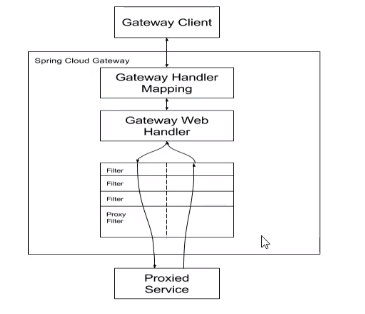

> 网关-GateWay

理论重点：微服务网关是如何选型的？

**SpringCloud Gateway使用的Webflux的reactor-netty的响应式编程组件，底层使用netty通讯框架**

1. Gateway与Zuul区别：

* Spring WebFlux,Reactor netty都是非阻塞式的响应式编程组件
* Zuul1.x是基于servlet2.5 使用阻塞架构，对于目前高并发显然不匹配。相比于Spring的WebFlux非阻塞框架，不能很好的应对高并发

SpringWebFlux（非阻塞式）+函数式编程，需要在java8以上（java8的高级特性）

* 作用：

  * 服务鉴权
  * 服务熔断
  * 日志监控
  * 流量控制

* 在微服务的位置

  

2. 三大核心概念

   1. 路由（Routing）：路由是构建网管的基本模块。是由ID、URI一系列的断言和过滤器组成，如果断言为true则匹配该路由。

   2. 断言（Predicate）：参考java8的java.util.function.Predecate开发人员可以匹配HTTP请求中所有的内容，包括请求头和请求参数，如果请求和断言相匹配则进行路由。

   3. 过滤（Filter）：指的是Spring框架中GatewayFilter实例，使用过滤器，可以在请求被路由器那或之后对应球进行修改

      

3. 工作流程

   

   1. 客户端向SpringCloudGateway发送请求，
   2. 然后在GateWayHandlerMappiing中找与之匹配的路由，将其发送给GatewayWenHandler。
   3. Handler再通过指定的过滤器链来将请求发送到实际的服务处理逻辑中
      1. 过滤器分开是因为pre前置过滤器，和post后置处理器执行业务逻辑
      2. pre前置：可以做参数校验，权限校验，日志输出，流量监控，协议转换
      3. post后置：可以做响应内容，响应头的修改，日志的输出，流量监控等

4. 配置方式：

   * xml配置

     ```yaml
     spring:
       application:
         name: cloud-gateway
       cloud:
         gateway:
           discovery:
             locator:
               enabled: true #开启注册中心动态创建路由的功能，利用微服务名称进行路由
           routes:
             - id: payment_route #路由id，保持唯一，建议与服务联合
               uri: http://localhost:8001 #匹配后提供服务的路由地址
               predicates:
                 - Path=/payment/get/**
             - id: payment_route1 #路由id，保持唯一，建议与服务联合
               uri: http://localhost:8001 #匹配后提供服务的路由地址
               predicates:
                 - Path=/payment/lb/** #断言，路径相匹配的进行路由
     ```

   * Java配置

     ```java
     @Configuration
     public class GateWayConfig {
         @Bean
         public RouteLocator customRouteLocator(RouteLocatorBuilder builder) {
             RouteLocatorBuilder.Builder routes = builder.routes();
             //参数1：唯一id，方法路由规则
             routes.route("custom_id", r -> r.path("/guonei")
                     .uri("https://xueshu.baidu.com/")).build();
             return routes.build();
         }
     }
     ```

   * 改进：

     * 默认情况，Gateway会根据注册中心的服务列表，以注册中心上微服务名为路径创建动态路由进行转发，从而实现动态路由的功能。

     * 之前我们是通过Ribbon进行负载均衡，而使用网关后，各种客户端需要访问9527端口，那么网关进行转发。通过lb标识，来使用负载均衡。

       

5. 

   1. After、Before、Between：以时间为节点进行断言

   2. Cookies：

      

      ```bash
      C:\Users\Administrator>curl http://localhost:9527/payment/lb --cookie "username=owen"
      8001
      ```

      ```yaml
      predicates:
        - Path=/payment/lb/** #断言，路径相匹配的进行路由
         - After=2020-03-12T16:44:15.064+08:00[Asia/Shanghai]  #在这个时间之后才能运行，例如项目上线后先不用，等到一定时间节点才启动
         - Cookie=username,owen #Cookie设置
         - Header=X-Request-Id,\d+ #请求头要有 X-Request-Id属性并且值为整数的正则表达式
         - Host=**.guigu.com # 主机的断言规则
         - Method=GET #请求方法必须是GET方法
         - Query=username,\d+ #要有参数username，并且还需要是整数
      ```

      以上便是断言规则，就是多一些限定条件

6. 过滤器：

   生命周期分为：分为前置过滤器和后置过滤器，如何设置

   种类分为：[GateWay过滤器](https://cloud.spring.io/spring-cloud-static/spring-cloud-gateway/2.2.2.RELEASE/reference/html/#gatewayfilter-factories)，总共30种；[Global过滤器](https://cloud.spring.io/spring-cloud-static/spring-cloud-gateway/2.2.2.RELEASE/reference/html/#global-filters)，总共10种

   **自定义全局过滤器**

   ```java
   @Component
   @Slf4j
   public class MyLogGateWayFilter implements GlobalFilter, Ordered {
   
       //过滤逻辑
       @Override
       public Mono<Void> filter(ServerWebExchange exchange, GatewayFilterChain chain) {
           log.info("---------------come in MyGateway");
           //请求投一定要带上uname
           String name = exchange.getRequest().getQueryParams().getFirst("uname");
           if (name == null) {
               log.info("--------------uname is null,reback");
               exchange.getResponse().setStatusCode(HttpStatus.NOT_ACCEPTABLE);
               return exchange.getResponse().setComplete();
           }
           //链路链会进行下一个过滤请求
           return chain.filter(exchange);
       }
   
       //过滤器的优先级，数字越小，优先级越高
       @Override
       public int getOrder() {
           return 0;
       }
   }
   ```

   **访问**

   ```bash
   http://localhost:9527/payment/lb?uname=owen
   ```

   

