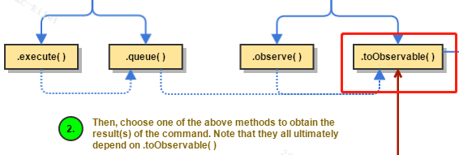

> Hystrix执行流程


1. Construct a HystrixCommand or HystrixObservableCommand

   * 构建一个HystrixCommand或者HystrixObservableCommand，封装请求，对其他服务进行调用。在需要传递降级的方法上添加该注解，包含了要传递的参数

     ```java
     @HystrixCommand(fallbackMethod = "paymentInfo_TimeoutHandler",commandProperties = {
             @HystrixProperty(name = "execution.isolation.thread.timeoutInMilliseconds",value = "3000")
     })
     ```

   * 用到了命令模式，通过参数调用相应的命令，例如超时3000中降级处理，并通过fallback跳转指定的方法里。

2. 命令执行

   * 翻译：然后选择上述方法中的一种来获得方法的结果，注意它们最终都依赖于.toObserve
   * 第一步选择不同的注解，将执行不同的方法，但是都会执行.toObservable()。

3. 判断是否在缓存中

   如果在缓存中，直接返回缓存结果，否则继续执行。

   由于可能发生网络中断或者用户重复点击等请求数据重复获取的情况，将命令对象存放在线程池中，先检查是否缓存命中，在发起网络请求，效率会有所提升。

4. circuit-breaker open

   判断是否开启断路器，如果第三步缓存未命中，并且断路器开启将进行fallback处理逻辑。如果是关闭则进行第五部

5. Semaphore/Thread pool rejected

   判断信号量或者线程池是否打满，如果打满则拒绝走fallback处理逻辑。

   指的注意的是，这里的线程池并不是消费者的请求线程池，而是针对每个请求对应的依赖服务创建的专有线程池。并且Hystrix为了保证不会因为某个依赖的问题，影响其他线程池，使用的“**舱壁模式**”，隔离每个服务。

6. 以上条件均满足，那么调用construct()或者run()，正常执行。

   * 首先判断是否执行失败，若失败直接调用fallback逻辑
   * 如果执行成功，判断是否超时，超时调用fallback逻辑，否则返回一个Observable对象结果

7. 在判断信号浪和线程池后，还要判断此服务是否添加了断路器，会向上判断执行。

8. 通过Hystrix-Dashboard仪表盘可以监控界面。

